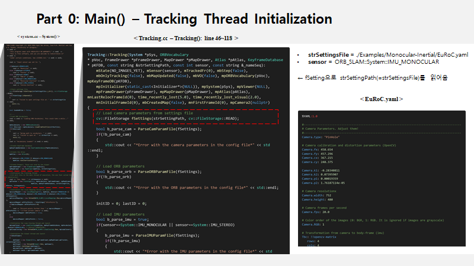
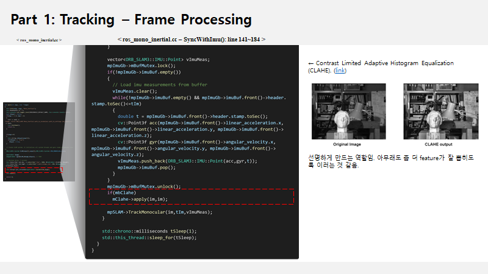
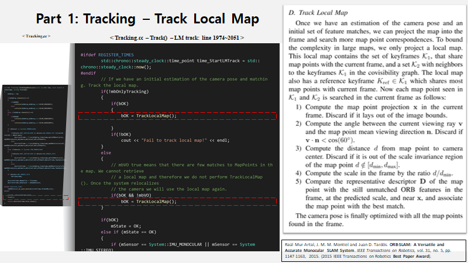

# ORBSLAM3_study (KR ver.)

* An English only ver. is not available yet. 

[Click](https://docs.google.com/presentation/d/1dy0OeC8hPvASXZEoDQFoEwP44VvPZlOu/edit?usp=sharing&ouid=118275914938046484469&rtpof=true&sd=true) to download PPT from Google Drive. 

이런 식으로 code 속에 어떤 코드가 있고 어떤 기능을 하는지 설명하는 방식으로 구성되어 있다.

그림으로 설명하는 것이 나은 경우에는 그림을 최대한 사용하려고 한다. 

논문을 직접 읽으면 도움 되는 것들은 논문을 캡쳐해서 가져온다. 
